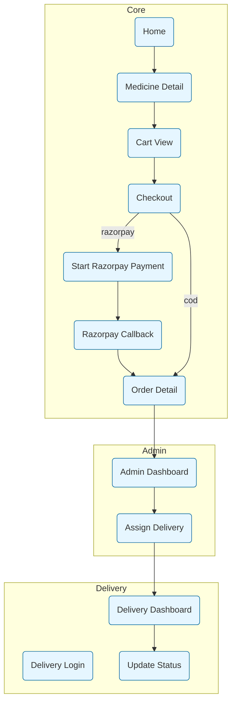

# MediDelivery — Project Report

**Generated:** February 23, 2026

## 1. Project Summary

MediDelivery is a Django-based online medicine ordering system. It supports browsing medicines, a session cart, checkout with Razorpay or Cash-on-Delivery (COD), order tracking, an admin panel to assign deliveries, and a delivery user interface to update status.

## 2. Technologies & Stack

- Backend: Django
- Database: SQLite (development)
- Frontend: Django templates + CSS (`core/static/core/css/style.css`)
- Payments: Razorpay (keys in `.env`)

## 3. Repository Structure (high level)

- `config/` — Django settings and URL routing
- `core/` — Main app: models, views, templates, cart & checkout
- `delivery/` — Delivery user flows and templates
- `adminapp/` — Admin portal to monitor & assign orders
- `media/` — uploaded images
- Top-level: `manage.py`, `requirements.txt`, `.env`, `db.sqlite3`

## 4. Working Flow Chart

Flow from user browsing to delivery completion:

```mermaid
flowchart LR
  A[User: Browse Medicines] --> B[View Medicine Detail]
  B --> C[Add to Cart]
  C --> D[Cart View]
  D --> E[Checkout]
  E --> F{Payment Method}
  F -->|COD| G[Create Order (is_paid: false)]
  F -->|Razorpay| H[Start Razorpay Checkout]
  H --> I[Payment Success]
  I --> J[Mark Order is_paid = true]
  J --> G
  G --> K[Order Placed]
  K --> L[Admin assigns delivery]
  L --> M[Delivery user receives assignment]
  M --> N[Delivery updates status: packed -> shipped -> delivered]
  N --> O[Order Completed]
```

> Note: To view Mermaid diagrams, open this file in a renderer that supports Mermaid (e.g., VS Code with Mermaid Preview, GitHub, or a Markdown viewer with Mermaid support).

## 5. Model-Relation / Database Flow (ER Diagram)

```mermaid
erDiagram
  USER ||--o{ PROFILE : has
  USER ||--o{ ORDER : places
  ORDER ||--o{ ORDERITEM : contains
  MEDICINE ||--o{ ORDERITEM : "is referenced by"
  USER ||--o{ ORDER : "assigned_delivery (nullable)"

  USER {
    integer id PK
    string username
    string email
  }
  PROFILE {
    integer id PK
    integer user_id FK
    string role
    string phone
    text address
  }
  MEDICINE {
    integer id PK
    string name
    string brand
    decimal price
    integer stock
  }
  ORDER {
    integer id PK
    integer user_id FK
    integer assigned_delivery_id FK nullable
    string status
    string payment_method
    boolean is_paid
    datetime created_at
  }
  ORDERITEM {
    integer id PK
    integer order_id FK
    integer medicine_id FK
    integer quantity
    decimal unit_price
  }
```

## 6. Function Flow Chart (major view & handler flows)



## 7. Key Files & Roles

- `config/settings.py` — loads `.env`, sets `RAZORPAY_KEY_ID` and `RAZORPAY_KEY_SECRET`.
- `core/models.py` — defines `Medicine`, `Order`, `OrderItem`, `Profile` and signals.
- `core/views.py` — cart, checkout, order creation, Razorpay integration, authentication helpers.
- `delivery/views.py` — delivery user flows and status updates.
- `adminapp/views.py` — admin dashboard & assign delivery logic.
- Templates: `core/templates/core/` (home, cart, checkout, order, payment views).

## 8. Setup & Export Instructions

Open `MediDelivery_Report.md` in a Markdown renderer that supports Mermaid. To export to PDF or DOCX:

- Browser/Editor → Print
  - In VS Code: install Mermaid preview or open the HTML variant; use `Print` to PDF.

- Using `pandoc` to convert to DOCX (requires pandoc installed):

```bash
# From project/report/
pandoc MediDelivery_Report.md -o MediDelivery_Report.docx --from markdown+mermaid
```

- Using `pandoc` to convert to PDF (requires LaTeX or wkhtmltopdf for proper rendering of mermaid diagrams):

```bash
pandoc MediDelivery_Report.md -o MediDelivery_Report.pdf --pdf-engine=wkhtmltopdf
```

If your pandoc version does not render Mermaid blocks, render the diagrams to images first (e.g., using mermaid-cli) and include them in the Markdown.

## 9. Notes & Recommendations (summary)

- Move secrets (`SECRET_KEY`, Razorpay keys) out of source and into environment management.
- Verify Razorpay signatures on callbacks in production.
- Add unit tests for cart/checkout and role-based access.
- Use PostgreSQL and S3 or CDN for static & media in production.

---

**Files referenced in report:** `config/settings.py`, `core/models.py`, `core/views.py`, `delivery/views.py`, `adminapp/views.py`

If you want, I can now: generate a PDF here (I may need headless Chrome/wkhtmltopdf), produce a `.docx` via pandoc (if available), or export Mermaid diagrams to images and embed them in the Markdown. Which would you like next?